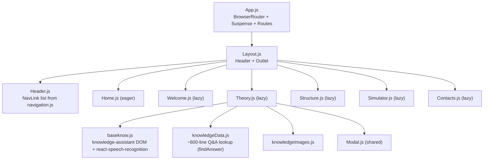

# System Architecture — react-cms-project

## Paradigm

**Client-only React single-page application**, no server tier. Create React App
(`react-scripts` 5.0.1) provides the build/dev toolchain; `react-router-dom` v6
handles client-side routing; styling is CSS Modules layered over a small
design-token sheet. There is no backend service and no database — every page
is static educational content plus client-side interactivity (tooltips,
Web Speech API). This is a small student/educational project, so the spine
below stays intentionally light: a handful of binding conventions, not a
platform-scale architecture.

## Stack (seed)

| Layer | Choice | Notes |
|---|---|---|
| Language | JavaScript (JSX), no TypeScript | |
| UI framework | React 18.2 | `ReactDOM.createRoot`, `React.StrictMode` |
| Build tooling | Create React App / `react-scripts` 5.0.1 | `yarn start`, `yarn build`, `yarn test` |
| Routing | `react-router-dom` ^6.3.0 | `BrowserRouter` + nested `Route`/`Outlet` |
| Styling | CSS Modules + hand-rolled CSS custom-property theme | No CSS-in-JS, no Tailwind/UI kit |
| Backend | **None** | No server, no API layer, no auth |
| Database | **None** | No persistence layer; nothing is stored beyond the browser session |
| Notable third-party libs | `react-tooltip` ^4.2.21, `react-speech-recognition` ^3.10.0 | Used only on the Theory page |
| Package manager | Yarn (`yarn.lock` is the only lockfile) | `package-lock.json` must not be generated/committed |
| Linting | CRA's `eslintConfig` (`react-app`, `react-app/jest`) | No standalone lint script |
| Formatting | Prettier via `src/.prettierrc` | `printWidth: 120`, single quotes, trailing commas, semicolons |
| Testing | CRA's Jest + React Testing Library | `yarn test --watchAll=false` |

## Core modules

- **`src/App.js`** — owns `BrowserRouter` and every route definition inside a
  top-level `Suspense`. `Home` and `Layout` are imported eagerly; every other
  route is `React.lazy`-loaded and code-split.
- **`src/components/Layout/Layout.js`** — the shared parent route
  (`<Route path="/" element={<Layout />}>`); renders `Header` plus an
  `Outlet` for the active nested page.
- **`src/components/Layout/Header/Header.js`** — builds nav links from
  `src/config/navigation.js` using `NavLink`.
- **Feature pages**, one folder per route under `src/components/`: `Home`,
  `Welcome`, `Theory`, `Structure`, `Simulator`, `Contacts`, plus the shared
  `Modal`. Each folder pairs `<Name>.js` with a co-located
  `<Name>.module.css`.
- **`src/components/Theory/`** — the largest and most unusual module: long-form
  physics content with inline formula images and `react-tooltip` popovers,
  plus a "knowledge assistant" dialog. `baseknow.js` wires that dialog's DOM
  (including microphone input via `react-speech-recognition`);
  `knowledgeData.js` holds the Q&A lookup table `findAnswer` reads from.
- **Styling** has three layers: `src/styles/theme.css` (design tokens:
  `--color-*`, `--shadow-*`, `--radius-*`, `--space-*`), `src/index.css` /
  `src/App.css` (global resets and base element styles), and each
  component's own CSS Module for everything component-specific.

## Architecture decisions (binding invariants)

Each `AD` is ratified from what the current code already does — the rule a
new page or module must follow to stay consistent with the rest, not a new
choice.

- **AD-1 — Route/nav is two manually-synced tables, not one source of truth.**
  Binds: every new route. Prevents: a route that exists in `App.js` without a
  matching nav entry (or vice versa). Rule: adding or renaming a route
  requires updating both `App.js`'s `<Route>` list and the corresponding
  entry in `src/config/navigation.js` by hand.

- **AD-2 — Route code-splitting is selective, not blanket.** Binds: new
  top-level pages. Prevents: unnecessary bundle bloat from eagerly importing
  every page, or `Suspense` fallbacks flashing on the very first paint.
  Rule: `Home` and `Layout` stay eager imports (first paint / chrome); every
  other route is `React.lazy` inside the single top-level `Suspense` in
  `App.js`.

- **AD-3 — One feature folder per page, CSS Modules only.** Binds: any new
  page or shared component. Prevents: global CSS leakage and scattered
  per-page styling conventions. Rule: a new page gets its own folder under
  `src/components/` with `<Name>.js` + `<Name>.module.css`; styles never go
  in a shared global stylesheet unless they are a true reset/base element
  style (those live in `index.css`/`App.css` only).

- **AD-4 — Theme tokens are the only source of color/shadow/radius/spacing
  values.** Binds: all component CSS Modules. Prevents: ad hoc hex colors or
  box-shadow values drifting from the design system defined in
  `src/styles/theme.css`. Rule: if a token already covers a color, shadow,
  radius, or spacing value, use `var(--token-name)` — never hardcode the
  literal.

- **AD-5 — No backend, no persistence layer.** Binds: every feature. Prevents:
  quietly introducing a server dependency, a database, or client-side storage
  as a hidden requirement for what is a static content + browser-API app.
  Rule: all data (physics content, Q&A pairs, images) ships as static
  JS/CSS/image assets in the bundle; anything that looks like it needs
  server-side state should be treated as out of scope until a real
  requirement forces the decision (see Deferred).

- **AD-6 — Browser-API failures are runtime concerns, not bugs.** Binds: the
  Theory page's knowledge assistant. Prevents: treating denied microphone
  permissions or an unsupported Speech Recognition API as defects to "fix."
  Rule: `baseknow.js` and its `react-speech-recognition` integration must
  degrade gracefully when mic access or the Speech API is unavailable, but
  that unavailability itself is expected environment variance, not a code
  fault.

- **AD-7 — `App.test.js` is not a behavior contract.** Binds: test changes.
  Prevents: treating unmodified CRA boilerplate assertions (which may check
  text that no longer exists) as spec. Rule: update `App.test.js` to match
  current behavior rather than preserving its original assertions.

## Coding standards

- **Package manager:** Yarn only. `yarn.lock` is the single lockfile; never
  generate or commit a `package-lock.json`.
- **Commands:** `yarn start` (dev server), `yarn build` (production build —
  also the way ESLint warnings/errors surface, since there's no separate
  lint script), `yarn test --watchAll=false` (full non-interactive test run;
  append a path/substring to run one file).
- **Before finishing any change:** run `yarn build` and resolve new build
  errors or relevant ESLint warnings.
- **Formatting:** Prettier per `src/.prettierrc` — 120 print width, 2-space
  indent, single quotes, trailing commas, semicolons.
- **Linting:** CRA's built-in `eslintConfig`, extending `react-app` and
  `react-app/jest` — no custom ESLint config to maintain separately.
- **Component structure:** one folder per feature page under
  `src/components/`, each pairing `<Name>.js` with a co-located
  `<Name>.module.css` (CSS Modules, not global CSS, not CSS-in-JS).
- **Styling layers:** design tokens (`src/styles/theme.css`) → global
  resets/base elements (`src/index.css`, `src/App.css`) → component-specific
  styles (that component's CSS Module). Don't hardcode a value a theme token
  already covers.
- **Routing:** keep `src/App.js` route paths and `src/config/navigation.js`
  entries in sync manually — there is no single source of truth linking
  them (AD-1).
- **Code splitting:** new top-level pages should be `React.lazy`-loaded
  inside the existing `Suspense` boundary in `App.js`, following the pattern
  already used for `Welcome`/`Theory`/`Structure`/`Simulator`/`Contacts`
  (AD-2).
- **General change discipline (from project guidance):** keep changes small,
  focused, and understandable for a student project; avoid introducing
  abstractions, state-management libraries, or a backend/data layer beyond
  what a task actually requires.
- **Landing-style pages:** prefer the `.claude/agents/landing-creator.md`
  subagent (or its documented steps) when a task specifically adds a new
  page in the style of `Home` — it already encodes the CSS Modules + theme
  token conventions above.

## Deferred (intentionally not decided here)

These are real gaps in the current app, left open rather than invented,
because nothing in the existing code forces an answer yet:

- **State management** — there is no app-wide state library (no Redux,
  Context-based store, etc.); introduce one only when a concrete feature
  needs shared state across pages, not preemptively.
- **Backend / API / persistence** — none exists; if a future feature needs
  server-side data (e.g., saving simulator results), that decision should go
  through its own architecture discussion rather than being bolted on ad hoc.
- **Internationalization** — nav labels and page copy are hardcoded in
  Russian with no i18n framework; not addressed here.
- **Automated test coverage** — beyond CRA's boilerplate `App.test.js`
  (itself flagged as non-contractual, AD-7), there is no established testing
  strategy for components or the knowledge-assistant logic.
- **Speech/mic feature robustness** — `react-speech-recognition` behavior
  across browsers/permissions is a known runtime variance (AD-6), not
  something this document prescribes a fallback UX for.

## Notes on this document

Generated by scanning the existing codebase directly (package.json, `src/`
tree, `App.js`, `navigation.js`, `theme.css`, `.prettierrc`) rather than
through an interactive elicitation session — it ratifies conventions the code
already demonstrates instead of proposing new ones. The BMAD `uv`-backed
tooling (`resolve_customization.py`, `resolve_config.py`, `memlog.py`,
automated Reviewer Gate) was unavailable in this environment at generation
time (`uv` not yet installed), so this file was authored directly instead of
through the standard memlog-then-distill workflow; no material process
should be affected once `uv` is available for future BMAD runs.
